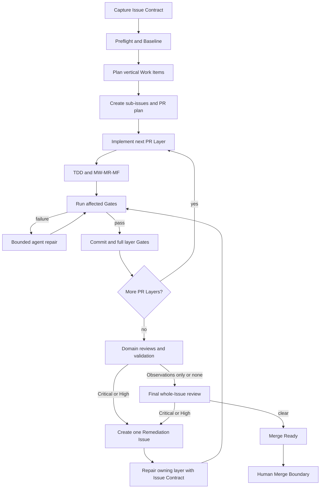

# Software Factory MVP

## Outcome

Given one trusted GitHub Issue, the Software Factory autonomously produces one reviewed pull request or native PR Stack that is ready for a human merge decision. One Factory Run serves one Issue; an original run and its remediation runs form a Factory Loop.

The operator starts work locally with a command shaped like:

```sh
pnpm process issue 'owner/repo#42'
```

The command is the authorization to begin. The Factory may create branches, sub-issues, pull requests, review comments, and its own namespaced labels, but it never merges.

## MVP flow



## Non-negotiable invariants

- The immutable Issue Contract accompanies every Work Item and Remediation Issue.
- Decomposition uses vertical, independently testable slices. Preparatory layers are allowed only when they deliver a meaningful tested capability.
- Work Items and review findings are processed sequentially in v1.
- Repository health is measured against a pre-change Baseline; the Factory introduces no new failures and cannot report Merge Ready while a required check is red or flaky.
- Agents do not receive GitHub write authority. The orchestrator validates and performs every external mutation idempotently.
- Only the current terminal PR Layer closes the original Issue. Its closing link moves when remediation adds a new terminal layer.
- A human alone crosses the Merge Boundary.

## Planning and pull requests

The planner applies the dependency-aware principles of `plan-to-tasks`, then emits structured data that the orchestrator validates before creating GitHub sub-issues. It publishes the acceptance mapping, dependency graph, and intended PR Stack, then proceeds without waiting for approval.

An ordinary Issue may produce one PR. A larger Issue may produce as many PR Layers as its real dependency structure requires. Each layer must:

- map to acceptance criteria;
- provide an independently testable and reviewable outcome;
- explain why it depends on the preceding layer; and
- pass its own required Gates.

When implementation disproves the plan, v1 may perform a bounded replan without changing the Issue Contract. A required product or scope decision moves the loop to Needs Attention.

## Implementation discipline

Each PR Layer follows one canonical contract:

1. Establish the observable seam.
2. Write an integration test for new behavior or a regression test for a fix and observe it fail.
3. Make the smallest implementation pass.
4. Make Right by handling relevant edge cases, errors, types, and clarity.
5. Make Fast only for a measured requirement or demonstrated bottleneck.

Fast affected tests and type/lint checks run after each vertical slice. Generated repository-specific `do-work` checks run before commits. Every PR Layer passes all required repository checks, and the stack tip passes the complete suite including build and integration tests.

Gate failures are returned to the agent as bounded structured evidence rather than raw unlimited logs. Repeated identical failures consume the repair budget. One diagnostic rerun may identify a flaky test, but a required flaky check blocks Merge Ready.

Abide runs continuously through hooks and explicitly at commit/PR boundaries. The MVP pins the supporting fork revision and local endpoint configuration; an unavailable final Abide check blocks Merge Ready.

## Review and remediation

The review engine reuses the ten domain checklists and structured format of `cc-pr-review-ci`. Domains run sequentially as bounded read-only turns. A fresh no-context validator removes unsupported claims, assigns the final section, and merges duplicate root causes before the orchestrator posts anything.

- **Critical** and **High**: each creates a Remediation Issue and must be fixed before Merge Ready.
- **Observation**: grouped with other Observations into one Deferred Review Issue and not automatically fixed.
- A human dismissal suppresses an unchanged finding; changed relevant code makes it eligible for review again.
- Missing or timed-out review coverage is retried within budget and otherwise leads to Needs Attention.

Each remediation runs in a fresh agent session with the original Issue Contract, validated finding, owning PR Layer, relevant diff, and Gate evidence. A finding that invalidates an earlier layer repairs that layer and restacks dependants; a genuinely additive fix may become a new terminal PR Layer. After targeted re-review, a complete final whole-Issue review is mandatory.

## State and evidence

The explicit states are Preflight, Planning, Executing, Checking, Reviewing, Remediating, Merge Ready, Needs Attention, Stopped, and Completed. The active process ends at Merge Ready; later status reconciliation may observe the human merge and mark the loop Completed.

V1 keeps a minimal atomic run manifest with stable correlation IDs. It records state, attempts, Issue/sub-issue/branch/PR identities, effective budgets, Gate results, review findings, agent session identifiers, and external mutations. Remote state is reconciled before retrying a mutation.

GitHub receives one editable status comment plus durable plan, validated review, Needs Attention, and merge-ready reports. Raw source, full diffs, credentials, and unnecessarily large logs remain local and are redacted or bounded before persistence.

## Capability boundary

V1 supports:

- owned and trusted TypeScript repositories using npm, pnpm, or Yarn;
- a local Node.js/TypeScript orchestrator using pnpm;
- Claude Code through Sandcastle with Bedrock environment configuration;
- pinned skills installed into the isolated agent environment with `pnpm dlx skills add` and verified against a lock manifest;
- GitHub native stacked PRs through a replaceable adapter; and
- one active Factory Loop at a time.

V1 defers hosted execution, dashboards, hostile repositories, other language ecosystems, other coding agents, concurrent loops, sophisticated recovery, automatic retention, and automatic post-merge cleanup.

## Delivery milestones

### 1. One Issue to one healthy PR

Implement the CLI, Issue Contract, preflight, Baseline, one Sandcastle coding session, canonical TDD/MW-MR-MF prompt, deterministic Gates, and a merge-ready report. Prove the path with one medium TypeScript feature.

### 2. Decomposition and native PR Stacks

Add structured planning, GitHub sub-issues, dependency validation, named Sandcastle branches, native stack submission, per-layer Gates, and terminal closing-link management.

### 3. Review and remediation loop

Add sequential domain reviews, independent validation, stable finding identities, Critical/High Remediation Issues, grouped Observations, owning-layer repair/restacking, and final whole-Issue review.

### 4. Resumability and operational hardening

Add robust reconciliation, cooperative stopping/resuming, budget overrides, audit polish, Abide calibration checks, log pruning, completed-run cleanup, and compatibility-upgrade tests.

Each milestone is an end-to-end vertical tracer bullet and must be demonstrably usable before the next begins.
